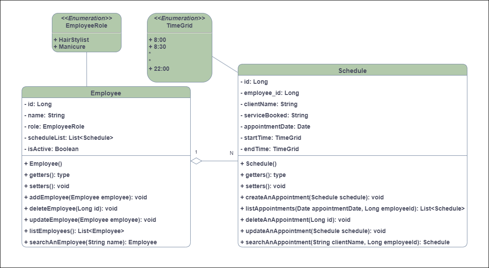

# ScheduEase
Projeto desenvolvido como avaliação final do módulo de Spring Boot do curso +Dev2Blu 2023. A ScheduEase é um BackEnd de uma aplicação
para salão de beleza que permite que cada profissional do salão se cadastre e gerencie sua agenda de horas marcadas de seus
respectivos clientes.

# Diagrama de Classes

   

# Requisitos Funcionais
Funcionário
- Cadastramento de funcionários.
- Exclusão de um cadastro de funcionário.
- Atualizar o cadastro de um funcionário.
- Listar funcionários cadastrados.
- Pesquisar um cadastro de funcionário pelo nome do mesmo.

Agenda
- Cadastramento de horários.
- Exclusão de um horário.
- Atualizar um horário
- Listar horários cadastrados.
- Pesquisar um horário pelo nome cliente agendado.
  
# Requisitos Não Funcionais
- Desenvolvido em Java.
- Spring Boot Framework.
- Cobertura mínima de código de 50%(testes unitários).
- Banco de Dados em Postgres.
- Documentação das API’s no Swagger.
- Maven para gerenciamento das dependências do projeto.
- Flyway para gerenciamento dos migrations do projeto.
- Deploy da aplicação no Railway.

# Regras de Negócio
- A aplicação deve permitir o agendamento de um horário para todo o ano das 8 às 22 horas.
- A aplicação deve listar os horários agendados e disponíveis do dia selecionado de seu respectivo funcionário/profissional.

# Documentação
- Arquivo Swagger-Doc.JSON disponível em resources/static.
- Arquivo do Insomnia para testar os endpoints da aplicação em localhost disponível em Documentation/Insomnia_Endpoints_localhost.json
- Arquivo do Insomnia para testar os endpoints da aplicação em produdução disponível em Documentation/Insomnia_Endpoints_Railway_Prodution.json
